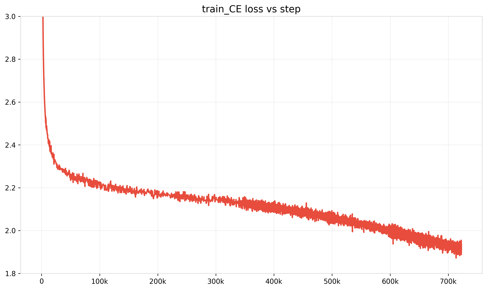
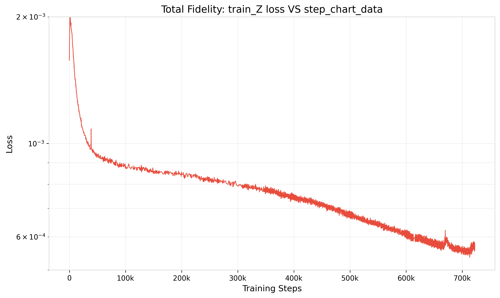
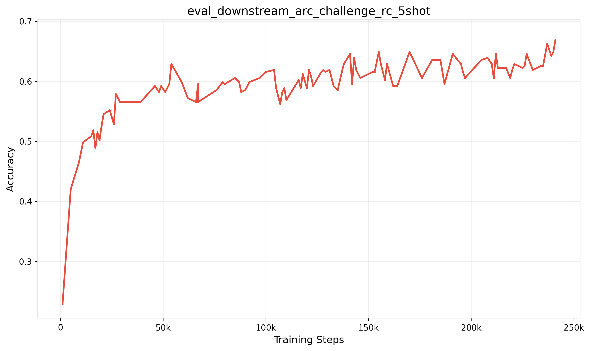
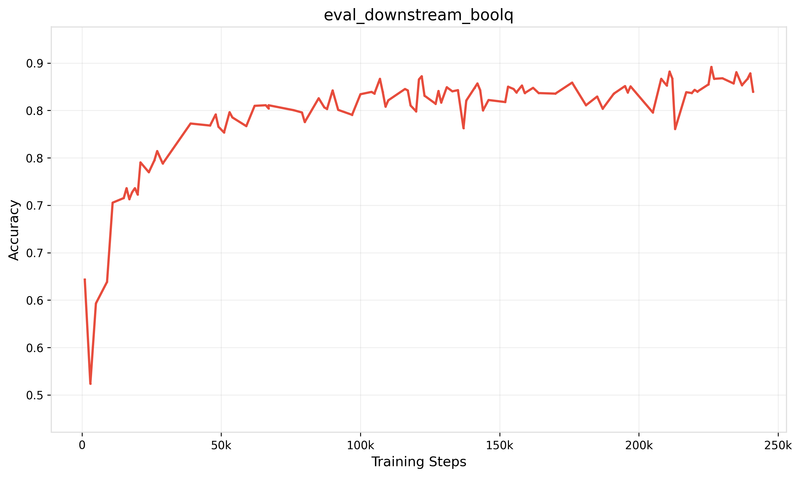
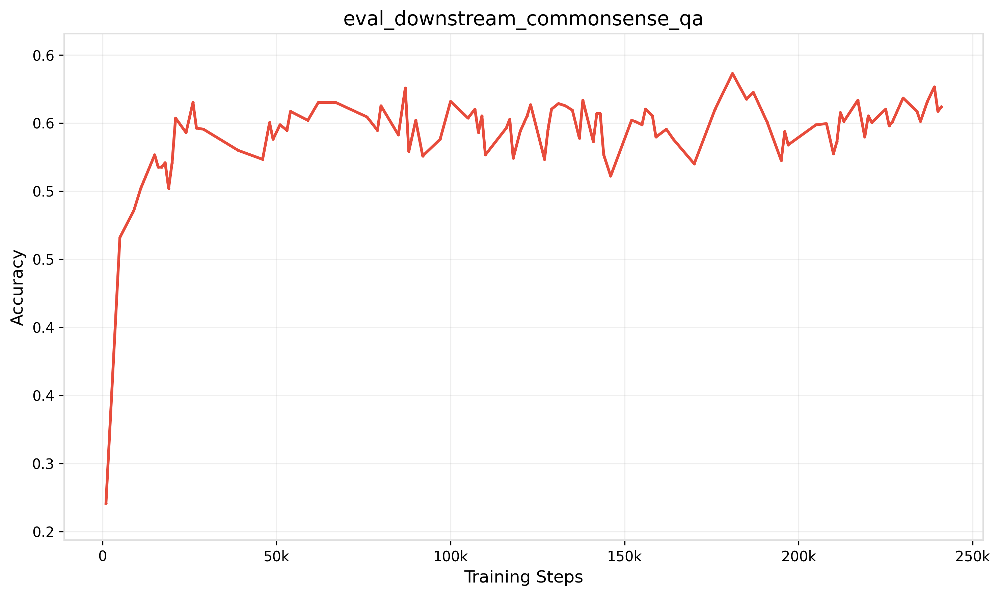
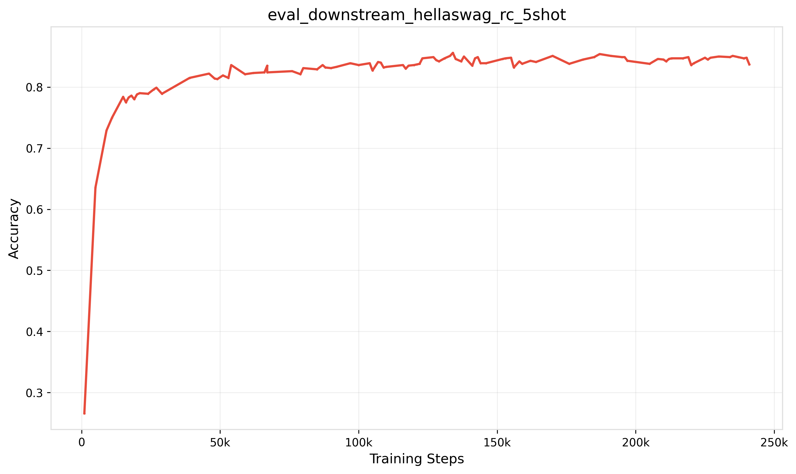
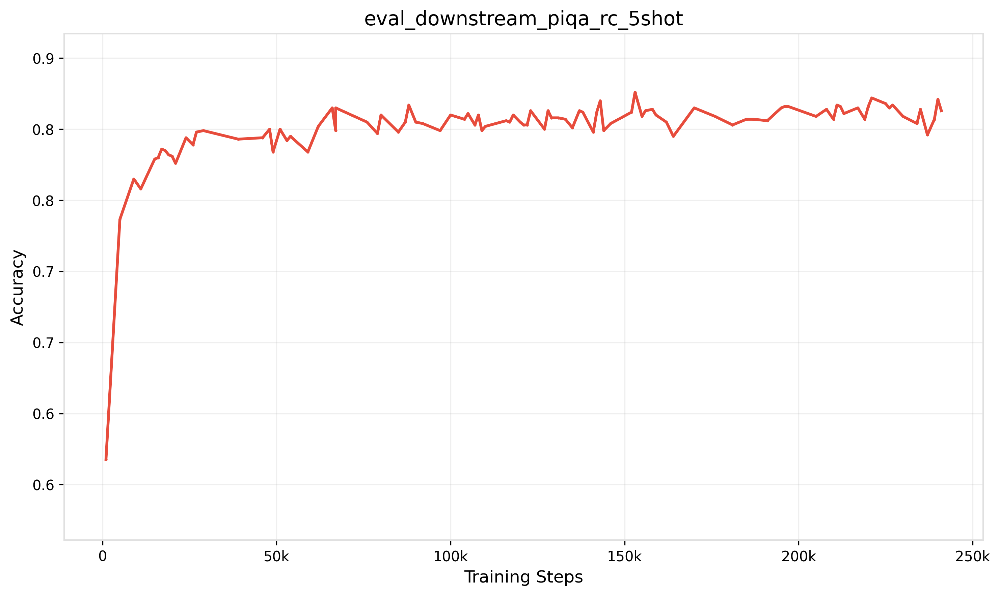

# OLMo-2-0325-32B Training Report

## Official Public Training Scripts

Please read the scripts carefully before attempting to run them. You may need to adjust hyperparameters based on your hardware.

## Stage1 Training Logs for OLMo-2-0325-32B
The following are the training logs for OLMo-2-0325-32B. Visit OLMo-2-0325-32B experiments page on [Comet ML](https://www.comet.com/ai2/olmo-2-0325-32b/view/new/panels) to learn more about them. 

### Training
   

### Evals
  
  